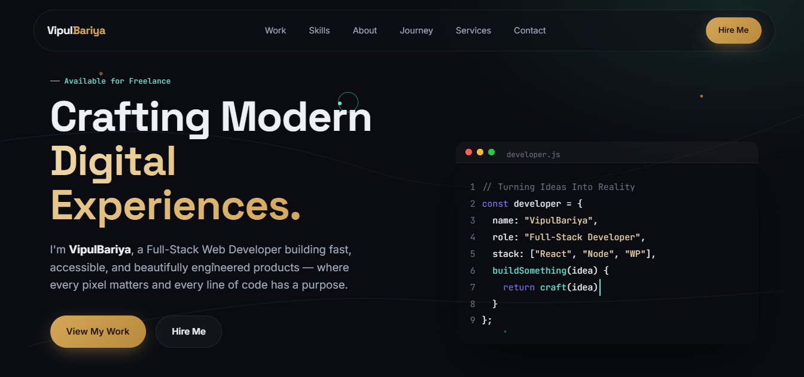

# Personal Portfolio — Bariya Vipul Kumar

[](https://vipulbariya-code.github.io/Personal-portfolio/)
[](https://developer.mozilla.org/docs/Web/HTML)
[](https://developer.mozilla.org/docs/Web/CSS)
[](https://developer.mozilla.org/docs/Web/JavaScript)

A responsive, accessible personal developer portfolio for **Bariya Vipul Kumar**, a 7th-semester B.Tech Computer Engineering student at **Ganpat University – U. V. Patel College of Engineering**, actively seeking an **8th-semester internship opportunity** in Web Development, PHP Development, and Cybersecurity.

## Live Website

Visit the portfolio: **[vipulbariya-code.github.io/Personal-portfolio](https://vipulbariya-code.github.io/Personal-portfolio/)**

## Preview



## Core Technical Skills

- **Web Development**: HTML5, CSS3, JavaScript, PHP, Flask
- **Databases**: MySQL, SQLite
- **Tools**: Git, GitHub, VS Code, XAMPP
- **Cybersecurity & AI**: Network Security, TCP Port Scanning, Security Testing, Gemini API

## Featured Projects

- **[CyberPort Scanner](https://cyberport-scanner.onrender.com/)** — Cybersecurity network reconnaissance tool to analyze network security by scanning open ports and detecting running services. Built with Python, Flask, SQLite, and Chart.js. [Source Code](https://github.com/vipulbariya-code/CyberPort-Scanner)
- **[Pick My AI](https://pickmyai.vercel.app/)** — AI tool discovery and comparison platform with Gemini API integration. Built with PHP, MySQL, and JavaScript.
- **[Personal Portfolio](https://vipulbariya-code.github.io/Personal-portfolio/)** — Modern, accessible, dark/light themed portfolio built with vanilla HTML, CSS, and JavaScript. [Source Code](https://github.com/vipulbariya-code/Personal-portfolio)

## Certifications

- **Introduction to Cybersecurity** — Cisco Networking Academy
- **Cybersecurity Fundamentals** — IBM
- **Foundations of Cybersecurity** — Coursera

## Run Locally

Clone the repository and open `index.html` in any modern web browser:

```bash
git clone https://github.com/vipulbariya-code/Personal-portfolio.git
cd Personal-portfolio
```

## Connect

- **GitHub**: [@vipulbariya-code](https://github.com/vipulbariya-code)
- **LinkedIn**: [Vipul Bariya](https://www.linkedin.com/in/vipul-bariya-23a46426b/)
- **Instagram**: [@vipul._x07](https://www.instagram.com/vipul._x07)
- **Email**: [vipulvbariya31@gmail.com](mailto:vipulvbariya31@gmail.com)

## License

This project is available for personal reference.
